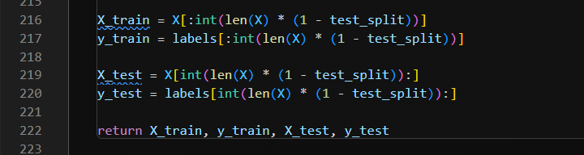
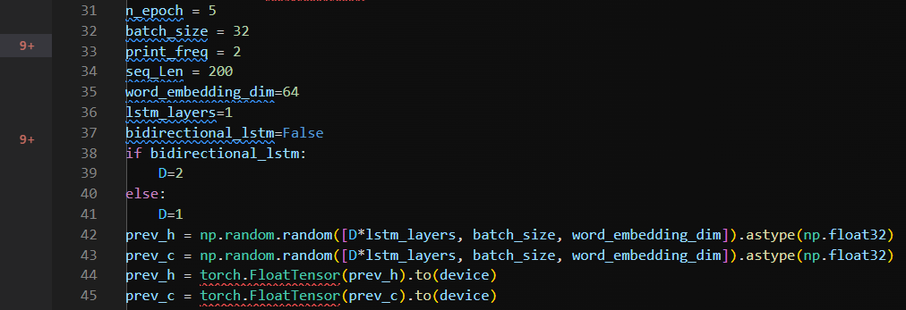
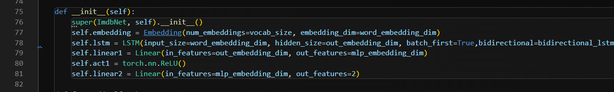

# imdb lstm 分类实验

## 执行命令：
```
python  example_imdb_lstm_torch.py
```
训练5 epoch, 耗时约1min，训练分类精度为 0.95

## 参考结果如下：
```log
MLU is not available, use GPU/CPU instead.
vocab_size:  20001
ImdbNet(
  (embedding): Embedding(20001, 64)
  (lstm): LSTM(64, 64, batch_first=True)
  (linear1): Linear(in_features=64, out_features=64, bias=True)
  (act1): ReLU()
  (linear2): Linear(in_features=64, out_features=2, bias=True)
)
Train Epoch: 1 Loss: 0.543348    Acc: 0.708300
Train Epoch: 2 Loss: 0.341218    Acc: 0.851350
Train Epoch: 3 Loss: 0.249663    Acc: 0.900200
Train Epoch: 4 Loss: 0.182878    Acc: 0.929600
Train Epoch: 5 Loss: 0.129030    Acc: 0.953850
```

## 作业要求

1、在lstm_manual_template.py内，使用torch给定的类（nn.Linear）等实现LSTM，不允许直接使用nn.LSTM或者nn.LSTMCell

2、精度要求待定（到时候群内和教学网会通知，如无通知则无要求）。

3、提交：代码（除去data文件夹），训练过程截图（包含精度），实验报告

PS：实验报告要求包括上述截图和其他任意你想写的内容（比如遇到什么困难、参数对实验的影响等等，也可以不写）。

## 修改

相比于之前的版本，我们修改了以下几处：

1、utlis.py中，删除了np.array()



2、example_imdb_lstm_torch.py中，对embedings的维度进行了变量描述，并添加了batch_first=True。具体参数可以参考LSTM的官方文档https://pytorch.org/docs/stable/generated/torch.nn.LSTM.html?highlight=nn+lstm#torch.nn.LSTM 





程序在numpy=1.24.1，pytorch=1.10.1，python=3.9下测试通过。

大家在实现自己的LSTM版本时，要注意batch维度和seq_len维度的位置，谁在前谁在后。**仔细阅读官方文档中的参数说明。**

